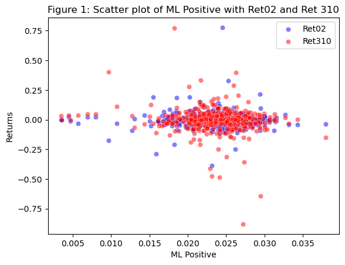
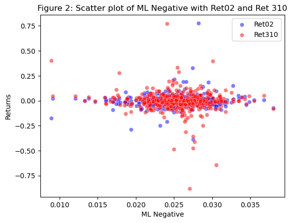
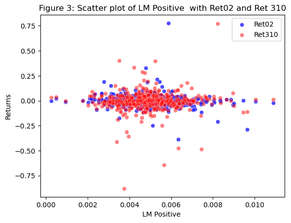
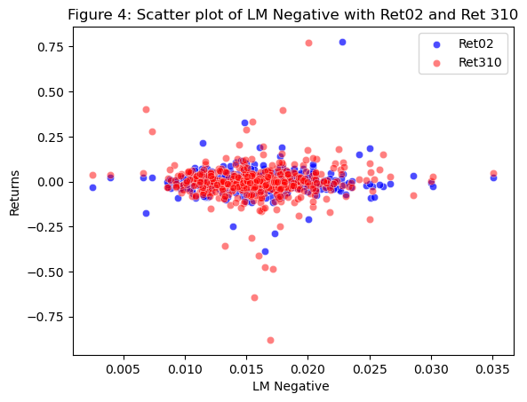
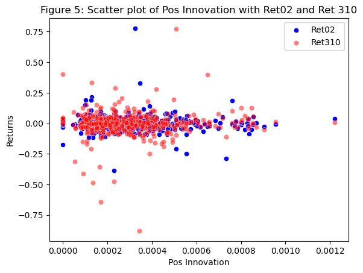
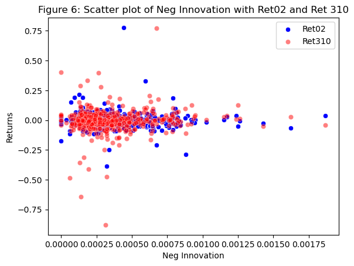
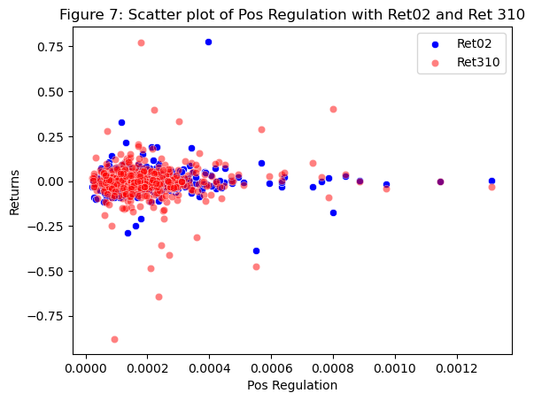
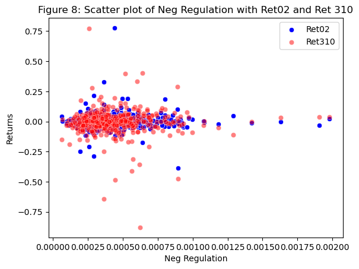
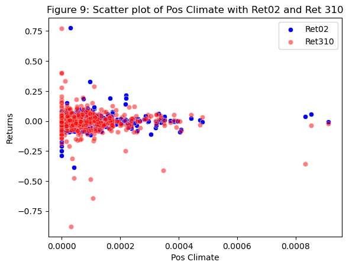
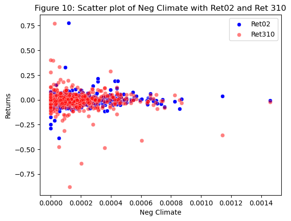

# Analysis Report

## Data Preparation


```python
import pandas as pd
import seaborn as sns
import matplotlib.pyplot as plt

analysisFile = 'output/analysis_sample.csv'
analysisDF = pd.read_csv(analysisFile) 
# analysisDF
```


```python

sentiment_cols = ['ML Positive', 'ML Negative', 'LM Positive', 'LM Negative', 'Pos Innovation', 'Neg Innovation', 'Pos Regulation', 'Neg Regulation', 'Pos Climate', 'Neg Climate']
return_cols = ['Ret02', 'Ret310']
corr_df = pd.DataFrame(columns=return_cols, index=sentiment_cols)

# Calculate correlation between each sentiment measure and each return measure
for sent_col in sentiment_cols:
    for ret_col in return_cols:
        corr_df.loc[sent_col, ret_col] = analysisDF[sent_col].corr(analysisDF[ret_col])
correlTable = corr_df
# print(correlTable)
```

## Summary


This project studies the effect of wording sentiment values on stock returns of S&P500 companies during the 2022 year. To achieve this goal, this project has taken all S&P500 companies 10k reports as well as their daily returns for 2022 and sought out to find correlations. Through cleaning the 10k file, performing rigorous analysis based on 10 unique contextual sentiment scorings, this project has been able to create correlations between word usage and stock returns. 

### Contexual Sentiments

This project studies 10 types of sentiments to determine the general tone of the 10k report. 

#### 4 Sentiments
- A positive sentiment: fraction of words in a 10k that are "positive" words
- A negative sentiment: fraction of words in a 10k that are "negative" words

To determine what words constitute as positive and negative, this project has created a LM and ML dictionaries to identify these words. 
LM sentiment dictionary comes from two researchers named Loughran and McDonald, who have identified from a master dictionary of words, which words are considered positive and negative.
ML sentiment dictionary comes from a machine algorithim which determined which words are commonly associated as being negative or positive in financial literature. 
These dictionaries have created the first 4 sentiment scores that are used to score the 10k reports. 

#### 6 Contextual Sentiments
For the remaining 6 types of sentiments, I have chosen to study the sentiment of the text in a 10k regarding the following particular topics: Innovation, Regulation, and Climate.

##### Why these Contextual Sentiments
I chose these contextual sentiments because I feel that their tone within a 10k report demonstrates how the company interacts and deals with these topics. 
- Innovation is important because it demonstrates how far a company is willing to go to create changes and new processes. Are they investing in R&D, are they changing their behaviors to adapt to new changes in their enviornments. 
- Regulation is interesting because the tone that surrounds it often has to do with new policies and rules that may constrict or expand an industry. With new regulations providing more or less freedom to companies, the tone that regulations have can often determine whether or not a company will expand or not.
- Climate is a hot topic these days as climate change and ESG are changing the way companies organize their operations and emmissions. Some companies may value the climate more than others and may be effected by global changes so determining this tone can provide more insight.

Overall, I chose these topics because they often correlate with how a company may perform as they may constrict or expand and industry and in doing so may increase or decrease returns.

#### What's the Sample?
The sample originally used was a zip file containing the first 20 firms in the sp500 and their 10k reports

#### How are the Sentiment Variables Built and Modified
- Create dictionaries from csv: (ex for ML positive)
```ML_positive = pd.read_csv('inputs/ML_positive_unigram.txt', header = None)[0].to_list()```
- Once the 10k reports have been downloaded, their htmls cleaned for for analysis, and filed dates have been found 
- I created a dataframe to hold their Ticker, Filled Date, Sentiment Scores, and Returns (this is not the identical dataframe used, but one to provide reference for how it was organized)
```finalDF = pd.DataFrame(columns = ["Symbol", "Date", "Sentiment Scores", "Returns"])```
- Using this dataframe, I calculated sentiment scores for all 10 values, an example for ML Positive: 
```
    ML_P_regex_list = ['('+'|'.join(ML_positive) +')']
    ML_P_value = (len(re.findall(NEAR_regex(ML_P_regex_list),html)) / html_len)
    finalDF.loc[index, 'ML Positive'] = ML_P_value
```
#### How are the Return Variables Built and Modified
- Downloaded all 2022 returns for all sp500 firms. Then by looping through my finalDF dataframe, I compared filing dates with dates in the 2022 returns, and calculated the cumProd for t, t+2, and t+3, t+10 returns. These returns were then added in their correct index within the finalDF dataframe
- The comparisions were done by the following: (this is for version 1 only and does not include for loop used)
```
    # Version 1
    filedDate10kIndex = finalRet[(finalRet['ticker'] == firm) & (finalRet['date'] == filedDate)].index.values
    if filedDate10kIndex:
        filedDate10kIndex = filedDate10kIndex[0]
        return_data = finalRet.iloc[filedDate10kIndex: filedDate10kIndex+3]
        cumProdv1 = return_data.assign(R=1+return_data['ret']).groupby(['ticker'])['R'].cumprod()
```


### Show and discuss summary stats of your final analysis sample

- Below is my analyzed dataframe using the .describe() method. 
### Caveat with the Data
- We can see that there are 487 observations which is less than the 500 expected because I had to drop certain rows of stocks if they didn't mean certain criteria. If they didn't have a filing date, if they were duplicates, or if they had a matching CIK number to another firm. Altough this may be too strict on my data, I had to remove these values in order to run my code. 

Some key things to understand from this analysis of all 10k reports of the sp500, the average returns after 10k filings were negative between -0.002114 and -0.005291. This indicates that firms did more poorly once releasing their 10k on average for 2022.


```python
analysisDF.describe()
```


<div>
<style scoped>
    .dataframe tbody tr th:only-of-type {
        vertical-align: middle;
    }

    .dataframe tbody tr th {
        vertical-align: top;
    }

    .dataframe thead th {
        text-align: right;
    }
</style>
<table border="1" class="dataframe">
  <thead>
    <tr style="text-align: right;">
      <th></th>
      <th>Unnamed: 0</th>
      <th>ML Positive</th>
      <th>ML Negative</th>
      <th>LM Positive</th>
      <th>LM Negative</th>
      <th>Pos Innovation</th>
      <th>Neg Innovation</th>
      <th>Pos Regulation</th>
      <th>Neg Regulation</th>
      <th>Pos Climate</th>
      <th>Neg Climate</th>
      <th>Ret02</th>
      <th>Ret310</th>
    </tr>
  </thead>
  <tbody>
    <tr>
      <th>count</th>
      <td>487.000000</td>
      <td>486.000000</td>
      <td>486.000000</td>
      <td>486.000000</td>
      <td>486.000000</td>
      <td>486.000000</td>
      <td>486.000000</td>
      <td>486.000000</td>
      <td>486.000000</td>
      <td>486.000000</td>
      <td>486.000000</td>
      <td>487.000000</td>
      <td>487.000000</td>
    </tr>
    <tr>
      <th>mean</th>
      <td>243.000000</td>
      <td>0.023485</td>
      <td>0.025470</td>
      <td>0.004935</td>
      <td>0.015826</td>
      <td>0.000301</td>
      <td>0.000360</td>
      <td>0.000199</td>
      <td>0.000434</td>
      <td>0.000089</td>
      <td>0.000192</td>
      <td>-0.002114</td>
      <td>-0.005291</td>
    </tr>
    <tr>
      <th>std</th>
      <td>140.729054</td>
      <td>0.004121</td>
      <td>0.003714</td>
      <td>0.001386</td>
      <td>0.003878</td>
      <td>0.000186</td>
      <td>0.000245</td>
      <td>0.000145</td>
      <td>0.000226</td>
      <td>0.000111</td>
      <td>0.000186</td>
      <td>0.062490</td>
      <td>0.099779</td>
    </tr>
    <tr>
      <th>min</th>
      <td>0.000000</td>
      <td>0.003530</td>
      <td>0.008953</td>
      <td>0.000272</td>
      <td>0.002541</td>
      <td>0.000000</td>
      <td>0.000000</td>
      <td>0.000022</td>
      <td>0.000065</td>
      <td>0.000000</td>
      <td>0.000000</td>
      <td>-0.386441</td>
      <td>-0.879700</td>
    </tr>
    <tr>
      <th>25%</th>
      <td>121.500000</td>
      <td>0.021511</td>
      <td>0.023537</td>
      <td>0.004014</td>
      <td>0.013252</td>
      <td>0.000167</td>
      <td>0.000197</td>
      <td>0.000116</td>
      <td>0.000293</td>
      <td>0.000017</td>
      <td>0.000059</td>
      <td>-0.024175</td>
      <td>-0.032508</td>
    </tr>
    <tr>
      <th>50%</th>
      <td>243.000000</td>
      <td>0.023857</td>
      <td>0.025719</td>
      <td>0.004860</td>
      <td>0.015603</td>
      <td>0.000261</td>
      <td>0.000297</td>
      <td>0.000166</td>
      <td>0.000381</td>
      <td>0.000058</td>
      <td>0.000148</td>
      <td>-0.003213</td>
      <td>-0.001513</td>
    </tr>
    <tr>
      <th>75%</th>
      <td>364.500000</td>
      <td>0.025944</td>
      <td>0.027639</td>
      <td>0.005674</td>
      <td>0.017876</td>
      <td>0.000391</td>
      <td>0.000459</td>
      <td>0.000240</td>
      <td>0.000519</td>
      <td>0.000119</td>
      <td>0.000266</td>
      <td>0.016848</td>
      <td>0.030540</td>
    </tr>
    <tr>
      <th>max</th>
      <td>486.000000</td>
      <td>0.037982</td>
      <td>0.038030</td>
      <td>0.010899</td>
      <td>0.035088</td>
      <td>0.001222</td>
      <td>0.001868</td>
      <td>0.001314</td>
      <td>0.001979</td>
      <td>0.000913</td>
      <td>0.001461</td>
      <td>0.777070</td>
      <td>0.773913</td>
    </tr>
  </tbody>
</table>
</div>


### Table 1: Correlation Between Sentiments and Returns 02, 310


```python
print(correlTable)
```

                       Ret02    Ret310
    ML Positive     0.006814 -0.121941
    ML Negative      0.07357 -0.095639
    LM Positive    -0.107474  0.026377
    LM Negative     0.047842 -0.009936
    Pos Innovation -0.034117  0.055829
    Neg Innovation -0.036645  0.071802
    Pos Regulation  0.020888  0.035933
    Neg Regulation  0.009907 -0.005188
    Pos Climate     0.066635 -0.095179
    Neg Climate     0.070016 -0.086495


- Based on an intial analysis, there seems to be more positive correlation for Ret02 with positive and negative Regulation topics and Climate. Innovation seems to be negative for both the positive and negative sentiments. 
- When looking at Ret310, Innovation seems to have positive sentiments while negative Regulation and both Climate topics resulted in negative values. This is interesting how the sentiments seemed to switch when looking at different return days. 

### Discussion Topics

On (1), (2), and (3) below: Focus just on the first return variable (which will examine returns around the 10-K publication)

On (4) below: Focus on how the “ML sentiment” variables (positive and negative) are related to the two different return measures.

### Question 1
 - Compare / contrast the relationship between the returns variable and the two “LM Sentiment” variables (positive and negative) with the relationship between the returns variable and the two “ML Sentiment” variables (positive and negative). Focus on the patterns of the signs of the relationships and the magnitudes.

When looking at figure 1: correlationTable: for Ret02
- ML Positive = 0.006814
- ML Negative = 0.07357
- LM Positive = -0.107474 
- LM Negative = 0.047842

Looking at the relationship of ML sentiment and LM sentiment for Ret02, we can notice that the ML sentiments are generally higher than the LM sentiments. Because the ML sentiments are comprised of keywords that are normally associated with financial terms and 10k reports, it makes sense that the sentiment scores will be higher; they appear more. The LM dictionary contains all words and whether or not they are positive or negative, so those words have less of a chance of appearing in the 10k reports. We also notice that the LM positive is a negative value, this means that the number of occurences for LM positive words in the 10k reports is much lower than those of the ML sentiments. 

### Question 2
- If your comparison/contrast conflicts with Table 3 of the Garcia, Hu, and Rohrer paper (ML_JFE.pdf, in the repo), discuss and brainstorm possible reasons why you think the results may differ. If your patterns agree, discuss why you think they bothered to include so many more firms and years and additional controls in their study? (It was more work than we did on this midterm, so why do it to get to the same point?)

My comparision conflicts with Table 3 of the Garcia, HU, and Rohrer paper. Some of these reasons could include my thinning of the dataframe. For firms with missing values, duplicates, or matching CIK values, I decided to drop them from my data frame immediately. This could have altered the sentiment values by removing firms that may have added more data to these scores. There is also a chance that my data is incorrect which is why my sentiment scores may be different than those in the paper. 

### Question 3
- Discuss your 3 “contextual” sentiment measures. Do they have a relationship with returns that looks “different enough” from zero to investigate further? If so, make an economic argument for why sentiment in that context can be value relevant.

I chose to explore Innovation, Regulation, and Climate. 
When analyzing their relationship to returns, I noticed that Climate looks "different enough" to investigate further. Climate has the greatest sentiment scores of 0.066635 for positive and 0.070016 for negative. These values are very promising as they suggest that firms that mention and speak about climate in their 10k reports have higher returns than those that discuss topics like innovation and regulation. I feel that this value could have been high if I used more keywords to describe climate. They keywords that I used included: 
(climate|enviornment|renewable|green|emissions|sustainability|climate change|carbon footprint).

Economic Argument: Given how many companies value the enviornment and changing climates, the tone at which these topics are discussed in a 10k report may provide a positive or negative expectations of a company's returns. 

### Question 4
- Focus on how the “ML sentiment” variables (positive and negative) are related to the two different return measures.
Is there a difference in the sign and magnitude? Speculate on why or why not.

When looking at the ML sentiment variables and their relationship to Ret02 and Ret310 I noticed that ML negative had a higher score than ML positive for Ret02, however both variables were positive. This positive value means that a 10k with a higher ML positive or negative sentiment for Ret02 will tend to yield higher results after 10k filing.  Similarly, for Ret310, ML negative had a higher score of -.0956 compared to -.1219 for ML Positive. These higher return values for both Ret02 and Ret310, suggest that the ML Negative dictionary is more common within the 10k reports. The magnitude between these values ranges by 0.066756. One thing to notice as well, is that for Ret02, both values are positive, and for Ret310 both values are negative. 

# Graphing

## Scatter Plots of each Sentiment Measure against Both Return Measures.
### Below are Figures 1 - 10


```python
# Create a scatter plot with ML Positive on x-axis and Ret02 and Ret310 on y-axis
sns.scatterplot(data = analysisDF, x = 'ML Positive', y='Ret02', color='blue', alpha=0.5)
sns.scatterplot(data = analysisDF, x = 'ML Positive', y='Ret310', color='red', alpha=0.5)

# Set axis labels and title
plt.xlabel('ML Positive')
plt.ylabel('Returns')
plt.title('Figure 1: Scatter plot of ML Positive with Ret02 and Ret 310')
plt.legend(labels=["Ret02","Ret310"])
plt.show()
```


    

    


```python
# Create a scatter plot with ML Positive on x-axis and Ret02 and Ret310 on y-axis
sns.scatterplot(data = analysisDF, x = 'ML Negative', y='Ret02', color='blue', alpha=0.5)
sns.scatterplot(data = analysisDF, x = 'ML Negative', y='Ret310', color='red', alpha=0.5)

# Set axis labels and title
plt.xlabel('ML Negative')
plt.ylabel('Returns')
plt.title('Figure 2: Scatter plot of ML Negative with Ret02 and Ret 310')
plt.legend(labels=["Ret02","Ret310"])
plt.show()
```


    

    


```python
# Create a scatter plot with LM Positive on x-axis and Ret02 and Ret310 on y-axis
sns.scatterplot(data = analysisDF, x = 'LM Positive', y='Ret02', color='blue', alpha=0.7)
sns.scatterplot(data = analysisDF, x = 'LM Positive', y='Ret310', color='red', alpha=0.5)

# Set axis labels and title
plt.xlabel('LM Positive ')
plt.ylabel('Returns')
plt.title('Figure 3: Scatter plot of LM Positive  with Ret02 and Ret 310')
plt.legend(labels=["Ret02","Ret310"])
plt.show()
```


    

    


```python
# Create a scatter plot with LM Negative on x-axis and Ret02 and Ret310 on y-axis
sns.scatterplot(data = analysisDF, x = 'LM Negative', y='Ret02', color='blue', alpha=0.7)
sns.scatterplot(data = analysisDF, x = 'LM Negative', y='Ret310', color='red', alpha=0.5)

# Set axis labels and title
plt.xlabel('LM Negative ')
plt.ylabel('Returns')
plt.title('Figure 4: Scatter plot of LM Negative with Ret02 and Ret 310')
plt.legend(labels=["Ret02","Ret310"])
plt.show()
```


    

    


```python
# Create a scatter plot with Pos Innovation on x-axis and Ret02 and Ret310 on y-axis
sns.scatterplot(data = analysisDF, x = 'Pos Innovation', y='Ret02', color='blue', alpha=1)
sns.scatterplot(data = analysisDF, x = 'Pos Innovation', y='Ret310', color='red', alpha=0.5)

# Set axis labels and title
plt.xlabel('Pos Innovation')
plt.ylabel('Returns')
plt.title('Figure 5: Scatter plot of Pos Innovation with Ret02 and Ret 310')
plt.legend(labels=["Ret02","Ret310"])
plt.show()
```


    

    


```python
# Create a scatter plot with Neg Innovation on x-axis and Ret02 and Ret310 on y-axis
sns.scatterplot(data = analysisDF, x = 'Neg Innovation', y='Ret02', color='blue', alpha=1)
sns.scatterplot(data = analysisDF, x = 'Neg Innovation', y='Ret310', color='red', alpha=0.5)

# Set axis labels and title
plt.xlabel('Neg Innovation')
plt.ylabel('Returns')
plt.title('Figure 6: Scatter plot of Neg Innovation with Ret02 and Ret 310')
plt.legend(labels=["Ret02","Ret310"])
plt.show()
```


    

    


```python
# Create a scatter plot with Pos Regulation on x-axis and Ret02 and Ret310 on y-axis
sns.scatterplot(data = analysisDF, x = 'Pos Regulation', y='Ret02', color='blue', alpha=1)
sns.scatterplot(data = analysisDF, x = 'Pos Regulation', y='Ret310', color='red', alpha=0.5)

# Set axis labels and title
plt.xlabel('Pos Regulation')
plt.ylabel('Returns')
plt.title('Figure 7: Scatter plot of Pos Regulation with Ret02 and Ret 310')
plt.legend(labels=["Ret02","Ret310"])
plt.show()
```


    

    


```python
# Create a scatter plot with Neg Regulation on x-axis and Ret02 and Ret310 on y-axis
sns.scatterplot(data = analysisDF, x = 'Neg Regulation', y='Ret02', color='blue', alpha=1)
sns.scatterplot(data = analysisDF, x = 'Neg Regulation', y='Ret310', color='red', alpha=0.5)

# Set axis labels and title
plt.xlabel('Neg Regulation')
plt.ylabel('Returns')
plt.title('Figure 8: Scatter plot of Neg Regulation with Ret02 and Ret 310')
plt.legend(labels=["Ret02","Ret310"])
plt.show()
```


    

    


```python
# Create a scatter plot with Pos Climate on x-axis and Ret02 and Ret310 on y-axis
sns.scatterplot(data = analysisDF, x = 'Pos Climate', y='Ret02', color='blue', alpha=1)
sns.scatterplot(data = analysisDF, x = 'Pos Climate', y='Ret310', color='red', alpha=0.5)

# Set axis labels and title
plt.xlabel('Pos Climate')
plt.ylabel('Returns')
plt.title('Figure 9: Scatter plot of Pos Climate with Ret02 and Ret 310')
plt.legend(labels=["Ret02","Ret310"])
plt.show()
```


    

    


```python
# Create a scatter plot with Neg Climate on x-axis and Ret02 and Ret310 on y-axis
sns.scatterplot(data = analysisDF, x = 'Neg Climate', y='Ret02', color='blue', alpha=1)
sns.scatterplot(data = analysisDF, x = 'Neg Climate', y='Ret310', color='red', alpha=0.5)

# Set axis labels and title
plt.xlabel('Neg Climate')
plt.ylabel('Returns')
plt.title('Figure 10: Scatter plot of Neg Climate with Ret02 and Ret 310')
plt.legend(labels=["Ret02","Ret310"])
plt.show()
```


    

    

